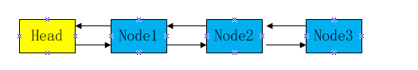
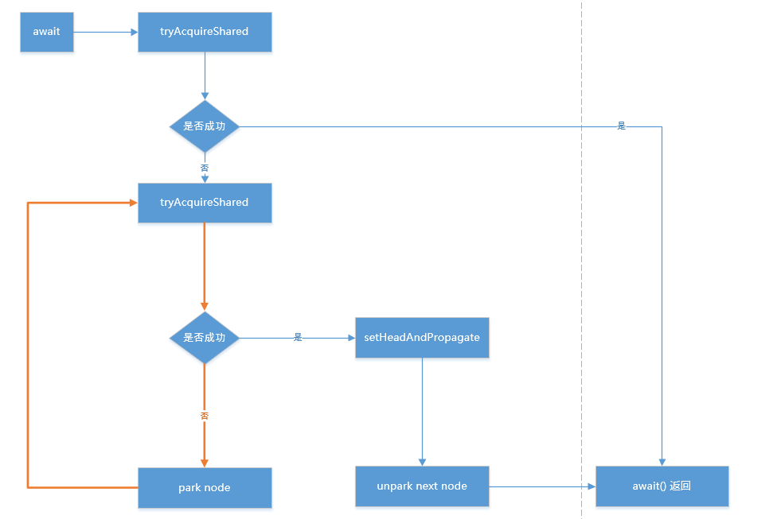

#java.util.concurrent包常用类
##1.Atomic类型的操作具有原子性的类
###1.1AtomicBoolean、AtomicInteger、AtomicLong等
　　这些类实例的一些方法是原子性的，即多个线程操作时，一次只会有一个线程在执行操作。原子变量类相当于一种泛化的volatile变量，能够支持原子的和有条件的读-改-写操作。   

###1.2 synchronized的实现
　　使用传统的synchronized关键字、基于阻塞的锁机制实现。

	class Counter {  
        
	    private int value;  
	  
	    public synchronized int getValue() {  
	        return value;  
	    }  
	  
	    public synchronized int increment() {  
	        return ++value;  
	    }  
	  
	    public synchronized int decrement() {  
	        return --value;  
	    }  
	}   
	
　　以上属于比较粗糙、粒度比较大的实现，Atomic的线程安全是基于硬件同步策略和CAS（compare and swap）实现的。
　　
####硬件同步策略
　　现在的处理器都支持多重处理，当然也包含多个处理器共享外围设备和内存，同时，加强了指令集以支持一些多处理的特殊需求。特别是几乎所有的处理器都可以将其他处理器阻塞以便更新共享变量。
　　
####Compare and swap（CAS）
　　每一个CAS操作过程都包含三个运算符：一个内存地址V，一个期望的值A和一个新值B，操作的时候如果这个地址上存放的值等于这个期望的值A，则将地址上的值赋为新值B，否则不做任何操作。这个交换过程完全是原子的，在CPU上计算完结果后，都会对比内存的结果是否还是原先的值，若不是，则认为不能替换，因为变量是volatile类型所以最终写入的数据会被其他线程看到，所以一个线程修改成功后，其他线程就发现自己修改失败了。   
　　   
　　CAS的实现
　　

	class CasCounter {
	
	    private SimulateCAS count;
	
	    public CasCounter(int initialValue) {
	        this.count = new SimulateCAS(initialValue);
	    }
	
	    public int getValue() {
	        return count.getValue();
	    }
	
	    public int increment() {
	        int oldValue = count.getValue();
	        //如果swap返回值与oldValue值不一致，说明已经有别的线程进行过了increment操作，需要重新赋值oldValue。直到本线程成功执行swap操作
	        while (count.compareAndSwap(oldValue, oldValue + 1) != oldValue) {
	            oldValue = count.getValue();
	        }
	        return oldValue + 1;
	    }
	
	}
	
	class SimulateCAS {
	
	    private int value;
	
	    public SimulateCAS(int value) {
	        this.value = value;
	    }
	
	    public synchronized int getValue() {
	        return value;
	    }
	
	
	    /**
	     * 如果预期值和CAS当前值相等，则赋其新值。
	     *
	     * @return 返回CAS原有值
	     */
	    public synchronized int compareAndSwap(int expectedValue, int newValue) {
	        int oldValue = value;
	        if (value == expectedValue) {
	            value = newValue;
	        }
	        return oldValue;
	    }
	}　
　　Atomic类的CAS实际上是由JDK内部的Unsafe类提供的方法，该类提供了硬件级别的原子操作。Unsafe类的使用是受限的，其内部提供了很多直接操作内存的方法。并且java.util.concurrent.atomic包下的原子操作类都是基于CAS实现的。

	//获取内存地址偏移量
	public native long staticFieldOffset(Field paramField);
	//内存分配与释放等
	public native long allocateMemory(long paramLong);
	public native long reallocateMemory(long paramLong1, long paramLong2);
	public native void freeMemory(long paramLong);

##2.ReentrantLock
###2.1 与synchronized的区别   
　　ａ.synchronized由编译器去执行加锁和释放，只需要在代码块或者方法声明即可。ReentrantLock需要手动来加锁和释放(粒度更细)，一般把unlock放在finally执行以避免忘记手动释放锁导致死锁。   
　　b.synchronized是非公平锁，而ReentrantLock可以指定锁类型。公平锁会按照线程提交的顺序获取到锁，而非公平锁是随机唤醒线程来获取锁。
###2.2 一些使用场景
　　ａ.如果任务已经在执行中，则不再执行　　
	
	ReentrantLock lock = new ReentrantLock();
	
	//如果获取锁失败会直接返回
	if(lock.tryLock()){
		try {
			//do something
		} finally {
		  lock.unlock();
		}
	}
   
　　b.如果任务已经在执行，则等待被执行
   
	ReentrantLock lock = new ReentrantLock();

	try {
		//如果获取不到锁，则会等待锁被释放
		lock.lock();
		//do something
	} finally {
		lock.unlock();
	}

　　c.如果任务已经在执行，则尝试等待一段时间，超时则放弃

	ReentrantLock lock = new ReentrantLock();
	
	//如果获取锁失败，
	try{
		if(lock.tryLock(5, TimeUnit.SECONDS)){
			try{
				//do something
			}finally{
				lock.unlock();
			}
		}
	}catch(InterruptedException e){
		
	}

　　d.如果任务已经在执行，则进行可以被中断的等待（可中断加锁）

	ReentrantLock lock = new ReentrantLock();
	
	try{
		//如果有进程调用次线程的interrupt()方法，则会响应中断
		lock.lockInterruptibly();
		//do something	
	} catch (InterruptedException e) {
		e.printStackTrace();
	} finally {
		lock.unlock();
	}

　　f.配合Condition来实现线程间通信(生产者消费者模型、阻塞队列)

　　在Condition中，用await()替换wait()，用signal()替换notify()，用signalAll()替换notifyAll()，传统线程的通信方式，Condition都可以实现，这里注意，Condition是被绑定到Lock上的，要创建一个Lock的Condition必须用newCondition()方法。

　　Condition的强大之处在于它可以为多个线程间建立不同的Condition， 使用synchronized/wait()只有一个阻塞队列，notifyAll会唤起所有阻塞队列下的线程，而使用lock/condition，可以实现多个阻塞队列，signalAll只会唤起某个阻塞队列下的阻塞线程。

	ReentrantLock lock = new ReentrantLock();
	Condition notFull = lock.newCondition;
	Condition notEmpty = lock.newCondition;
	
	public void put() {
        lock.lock();
        try {
            while (container.size() == maxSize) {
                System.out.print(Thread.currentThread().getName() + ": wait \n");
                notFull.await();//阻塞生产线程
            }
            container.add(new Date());
            System.out.println(Thread.currentThread().getName() + ": put:" + container.size());
            Thread.sleep(1000);
            notEmpty.signalAll();//唤醒消费线程
        } catch (InterruptedException e) {
            e.printStackTrace();
        } finally {
            lock.unlock();
        }
    }
    
    public void take() {
        lock.lock();
        try {
            while (container.size() == 0) {
                System.out.print(Thread.currentThread().getName() + ": wait \n");
                notEmpty.await();//阻塞生产线程
            }
            ((LinkedList<Date>) container).poll();
            System.out.println(Thread.currentThread().getName() + ": take:" + container.size());
            Thread.sleep(1000);
            notFull.signalAll();//唤醒消费线程
            notFull.signal();
        } catch (InterruptedException e) {
            e.printStackTrace();
        } finally {
            lock.unlock();
        }
    }
    
##3.ArrayBlockingQueue
###3.1 ArrayBlockingQueue介绍
　　ArrayBlockingQueue是数组实现的线程安全的有界的阻塞队列。线程安全是指其内部通过ReentrantLock实现了多线程对竞争资源的互斥访问，有界是指队列底层的数组是有界限的。
　　
###3.2 ArrayBlockingQueue部分源码

a.offer和put方法（poll和take方法类似）
	
	//把指定元素插入到队列中，如果队列已满则插入失败
    public boolean offer(E e) {
        checkNotNull(e);
        final ReentrantLock lock = this.lock;
        lock.lock();
        try {
            if (count == items.length)
                return false;
            else {
                enqueue(e);
                return true;
            }
        } finally {
            lock.unlock();
        }
    }
    
    //把指定的元素插入到队列中，如果队列已满则等待指定时长，过后队列还是满的则抛弃元素
    public boolean offer(E e, long timeout, TimeUnit unit)
        throws InterruptedException {

        checkNotNull(e);
        long nanos = unit.toNanos(timeout);
        final ReentrantLock lock = this.lock;
        lock.lockInterruptibly();
        try {
            while (count == items.length) {
                if (nanos <= 0)
                    return false;
                nanos = notFull.awaitNanos(nanos);
            }
            enqueue(e);
            return true;
        } finally {
            lock.unlock();
        }
    }
    
    //如果队列已满，阻塞直到有空闲能插入元素
    public void put(E e) throws InterruptedException {
        checkNotNull(e);
        final ReentrantLock lock = this.lock;
        lock.lockInterruptibly();
        try {
            while (count == items.length)
                notFull.await();
            enqueue(e);
        } finally {
            lock.unlock();
        }
    }
    
    //底层数组进行入队操作，修改入队出队元素下标，且满足队列不为空的条件，随机唤醒一个出队的线程
    private void enqueue(E x) {
        // assert lock.getHoldCount() == 1;
        // assert items[putIndex] == null;
        final Object[] items = this.items;
        items[putIndex] = x;
        if (++putIndex == items.length)
            putIndex = 0;
        count++;
        notEmpty.signal();
    }
    

　　可以看到ArrayBlockingQueue和上一节基于ReentrantLock、Condition实现的阻塞队列原理是一样的。
　　
##4.CountDownLatch
###CountDownLatch简介
　　如果说ReentrantLock是排他锁，那么CountDownLatch就是共享锁了。CountDownLatch的作用类似于一个“栏栅”，在CountDownLatch的计数为0前，调用await方法的线程将一直阻塞，直到CountDownLatch计数为0，await方法才会返回，
     而CountDownLatch的countDown()方法则一般由各个线程调用，实现CountDownLatch计数的减1。在多个任务共同执行但是需要一组任务同时返回的场景下可以用到。使用起来也很简单，需要三个步骤。  
　　1.初始化CountDownLatch，指定其计数器的大小  
　　2.初始化各个线程，在每个线程执行完各自任务之后调用其countDown()方法，即可让计数器-1  
　　3.在提交所有任务之后，调用其await()方法，即可将进程阻塞，直到计数器归零（所有线程执行完毕）为止。
　　  
　　网关万达会员卡同步逻辑就使用到了CountDownLatch
　　

	public void syncMcardTypes(List<String> cinemaIds) {
        
        //初始化和需要同步的影院列表大小相等的计数器
        final CountDownLatch latch = new CountDownLatch(cinemaIds.size());
		
		 //所有同步会员卡的任务提交给线程池统一执行
        ExecutorService executors = Executors.newFixedThreadPool(5);

        for (int i = 0; i < cinemaIds.size(); i++) {

            executors.submit(new Runnable() {
                @Override
                public void run() {
                    try {
                        //拿影院id去第三方拉取会员卡
                    } catch (InterruptedException e) {
                        e.printStackTrace();
                    } finally {
                    	//和ReentrantLock一样，把计数器的变更放到finally代码块执行，避免锁无法释放的情况。
                        latch.countDown();
                    }
                }
            });
        }

        try {
        	  //等待锁的计数器归零为止
            latch.await();
        } catch (InterruptedException e) {
            e.printStackTrace();
        }
        //同步完所有会员卡信息，统一进行insert或者update操作
    }

##5.AbstractQueuedSynchronizer

###5.1 AbstractQueuedSynchronizer简介
　　ReentrantLock、CountDownLatch、Semaphore等类的实现都依赖AQS。它提供了一个基于FIFO的队列，可以用于构建锁或者其他相关同步装置的基础框架。AQS使用一个int型的state属性来表示状态。子类通过继承并实现它的方法来管理其状态，管理的方式主要是通过acquire和release方法来操作状态。  
　　  
AQS中state变量的定义

	private volatile int state;

    protected final int getState() {
        return state;
    }
    
	protected final void setState(int newState) {
        state = newState;
    }
 
	protected final boolean compareAndSetState(int expect, int update) {
        // See below for intrinsics setup to support this
        return unsafe.compareAndSwapInt(this, stateOffset, expect, update);
    }
  
  
　　首先，AQS并不关心“是什么锁”，对于AQS来说它只是实现了一系列的用于判断“资源”是否可以访问的API,并且封装了在“访问资源”受限时将请求访问的线程的加入队列、挂起、唤醒等操作， AQS只关心“资源不可以访问时，怎么处理？”、“资源是可以被同时访问，还是在同一时间只能被一个线程访问？”、“如果有线程等不及资源了，怎么从AQS的队列中退出？”等一系列围绕资源访问的问题，而至于“资源是否可以被访问？”这个问题则交给AQS的子类去实现。  
　　     
　　a.当AQS的子类是实现独占功能时，例如ReentrantLock，“资源是否可以被访问”被定义为只要AQS的state变量不为0，并且持有锁的线程不是当前线程，则代表资源不能访问。  
　　b.当AQS的子类是实现共享功能时，例如：CountDownLatch，“资源是否可以被访问”被定义为只要AQS的state变量不为0，说明资源不能访问。这是典型的将规则和操作分开的设计思路：规则子类定义，操作逻辑因为具有公用性，放在父类中去封装。   
　　
####5.1.1 AQS的数据结构
　　AQS是一个双向链表，通过节点中的next，pre变量分别指向当前节点后一个节点和前一个节点。其中，每个节点中都包含了一个线程和一个类型变量：表示当前节点是独占节点还是共享节点，头节点中的线程为正在占有锁的线程，而后的所有节点的线程表示为正在等待获取锁的线程。如下图所示：
　　
　　
　  
###5.2 通过CountDownLatch去分析AQS 
####5.2.1 构造方法

	
	public CountDownLatch(int count) {
        if (count < 0) throw new IllegalArgumentException("count < 0");
        this.sync = new Sync(count);
    }
    
　　Sync是CountDownLatch的内部类，继承了AQS
   
	Sync(int count) {
        setState(count);
    }
　　这里的state属性就是AQS的状态位，在ReentrantLock里代表加锁次数，而在CountDownLatch里代表其计数器的初始大小。
####5.2.2 await方法

	public void await() throws InterruptedException {
        sync.acquireSharedInterruptibly(1);
    }
　　调用了Sync的acquireSharedInterruptibly，其实是直接调用了其父类的acquireSharedInterruptibly方法

	public final void acquireSharedInterruptibly(int arg)
            throws InterruptedException {
        //如果
        if (Thread.interrupted())
            throw new InterruptedException();
        if (tryAcquireShared(arg) < 0)
            doAcquireSharedInterruptibly(arg);
    }
    
　　从方法名看这个方法时响应线程中断的，前两行代码会检查线程是否已被中断。接着调用tryAcquireShared方法尝试获取共享锁，如果返回值小于0表示获取失败，AQS在获取锁的思路是，先尝试直接获取锁，如果失败会将当前线程放在队列中，按照FIFO的原则等待锁。AQS中的tryAcquireShare方法留了空，需要子类去实现。  
  

    protected int tryAcquireShared(int arg) {
        throw new UnsupportedOperationException();
    }
    
　　而CountDownLatch的实现：

    protected int tryAcquireShared(int acquires) {
        return (getState() == 0) ? 1 : -1;
    }

　　如果state变成0了，则返回1，表示获取成功，否则返回-1则表示获取失败。如果tryAcquireShared失败了（返回-1，说明state不为0，即CountDownLatch的计数器还不为0）。尝试获取共享锁失败之后，按照AQS的逻辑应该是要把当前线程放入到队列中去（调用doAcquireSharedInterruptibly方法）。

    private void doAcquireSharedInterruptibly(int arg)
        throws InterruptedException {
        //将当前线程包装为类型为Node.SHARED的节点，标示这是一个共享节点。
        final Node node = addWaiter(Node.SHARED);
        boolean failed = true;
        try {
            for (;;) {
                final Node p = node.predecessor();
                //如果新建节点的前一个节点，就是Head，说明当前节点是AQS队列中等待获取锁的第一个节点，按照FIFO的原则，可以直接尝试获取锁。
                if (p == head) {
                    int r = tryAcquireShared(arg);
                    if (r >= 0) {
                    //获取成功，需要将当前节点设置为AQS队列中的第一个节点，这是AQS的规则，队列的头节点表示正在获取锁的节点
                        setHeadAndPropagate(node, r);
                        p.next = null; // help GC
                        failed = false;
                        return;
                    }
                }
                //检查下是否需要将当前节点挂起
                if (shouldParkAfterFailedAcquire(p, node) &&
                    parkAndCheckInterrupt())
                    throw new InterruptedException();
            }
        } finally {
            if (failed)
                cancelAcquire(node);
        }
    }
    
需要注意的是：  
	a.setHeadAndPropagate方法
	
	private void setHeadAndPropagate(Node node, int propagate) {
        Node h = head; // Record old head for check below
        setHead(node);
    
        if (propagate > 0 || h == null || h.waitStatus < 0 ||
            (h = head) == null || h.waitStatus < 0) {
            Node s = node.next;
            if (s == null || s.isShared())
                doReleaseShared();
        }
    }
    
首先，使用了CAS更换了头节点，然后，将当前节点的下一个节点取出来，如果同样是“shared”类型的，再做一个”releaseShared”操作。看下doReleaseShared方法：

    private void doReleaseShared() {
     
        for (;;) {
            Node h = head;
            if (h != null && h != tail) {
                int ws = h.waitStatus;
                //如果当前节点是SIGNAL状态，则表示它等待被唤醒，此时重置当前节点的waitStatus属性，并唤醒下一个节点
                if (ws == Node.SIGNAL) {
                    if (!compareAndSetWaitStatus(h, Node.SIGNAL, 0))
                        continue;            // loop to recheck cases
                    unparkSuccessor(h);
                }
                //如果本身头结点的waitStatus是出于重置状态（waitStatus==0）的，将其设置为“传播”状态。意味着需要将状态向后一个节点传播。
                else if (ws == 0 &&
                         !compareAndSetWaitStatus(h, 0, Node.PROPAGATE))
                    continue;                // loop on failed CAS
            }
            if (h == head)                   // loop if head changed
                break;
        }
    }

####5.2.3 countDown方法

	public void countDown() {
        sync.releaseShared(1);
    }
　　调用了AQS的releaseShared方法，参数固定为1

	public final boolean releaseShared(int arg) {
        if (tryReleaseShared(arg)) {
            doReleaseShared();
            return true;
        }
        return false;
    }
    
　　同样先尝试去释放锁，tryReleaseShared同样为空方法，留给子类自己去实现，以下是CountDownLatch的内部类Sync的实现：

    protected boolean tryReleaseShared(int releases) {
        // Decrement count; signal when transition to zero
        for (;;) {
            int c = getState();
            if (c == 0)
                return false;
            int nextc = c-1;
            if (compareAndSetState(c, nextc))
                return nextc == 0;
        }
    }
    
　　从上文的分析中可知，如果state的值为0，在CountDownLatch中意味：所有的子线程已经执行完毕，这个时候可以唤醒调用await()方法的线程了，而这些线程正在AQS的队列中，并被挂起的，所以下一步应该去唤醒AQS队列中的头结点了（AQS的队列为FIFO队列），然后由头节点去依次唤醒AQS队列中的其他共享节点。如果tryReleaseShared返回true,进入doReleaseShared()方法。  

　　当线程被唤醒后，会重新尝试获取共享锁，而对于CountDownLatch线程获取共享锁判断依据是state是否为0，而这个时候显然state已经变成了0，因此可以顺利获取共享锁并且依次唤醒AQS队里中后面的节点及对应的线程。
　　
###5.3总结
　　如果获取共享锁失败后，将请求共享锁的线程封装成Node对象放入AQS的队列中，并挂起Node对象对应的线程，实现请求锁线程的等待操作。待共享锁可以被获取后，从头节点开始，依次唤醒头节点及其以后的所有共享类型的节点。实现共享状态的传播。这里有几点值得注意：
    
　　1.与AQS的独占功能一样，共享锁是否可以被获取的判断为空方法，交由子类去实现。  
　　  
　　2.与AQS的独占功能不同，当锁被头节点获取后，独占功能是只有头节点获取锁，其余节点的线程继续沉睡，等待锁被释放后，才会唤醒下一个节点的线程，而共享功能是只要头节点获取锁成功，就在唤醒自身节点对应的线程的同时，继续唤醒AQS队列中的下一个节点的线程，每个节点在唤醒自身的同时还会唤醒下一个节点对应的线程，以实现共享状态的“向后传播”，从而实现共享功能。  

  
　　当AQS的子类是实现独占功能时，例如ReentrantLock，“资源是否可以被访问”被定义为只要AQS的state变量不为0，并且持有锁的线程不是当前线程，则代表资源不能访问。
当AQS的子类是实现共享功能时，例如：CountDownLatch，“资源是否可以被访问”被定义为只要AQS的state变量不为0，说明资源不能访问。这是典型的将规则和操作分开的设计思路：规则子类定义，操作逻辑因为具有公用性，放在父类中去封装。当然，正式因为AQS只是关心“资源在什么条件下可被访问”，所以子类还可以同时使用AQS的共享功能和独占功能的API以实现更为复杂的功能。